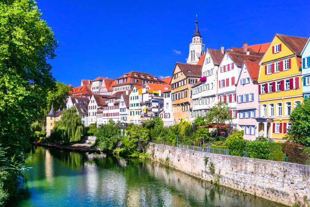
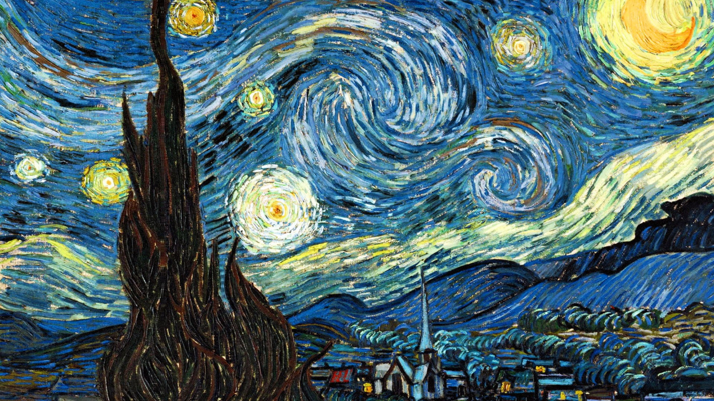

# Style-Transfer-using-Pytorch
In this notebook, i'm trying to recreate a style transfer method that is outlined in the paper, Image Style Transfer Using Convolutional Neural Networks, by Gatys in PyTorch
[link to Paper!](https://www.cv-foundation.org/openaccess/content_cvpr_2016/papers/Gatys_Image_Style_Transfer_CVPR_2016_paper.pdf).

This paper uses VGG19 model to create a new target image which should contain desired content and style components:

*objects and their arrangement are similar to that of the content image

*style, colors, and textures are similar to that of the style image

## Test the model

Here is the content & style of the first example

  
   

And the target of applying the model over the two images

Achieving a loss of 305766.5625 which is better than the referenced example here 

[CV Foundation](https://www.cv-foundation.org/openaccess/content_cvpr_2016/papers/Gatys_Image_Style_Transfer_CVPR_2016_paper.pdf)

Here is the content & style of the second example

  
   

And the target of applying the model over the two images

Achieving a loss of 289863.03125 which is better than the referenced example here 

[GitHub](https://github.com/udacity/deep-learning-v2-pytorch/blob/master/style-transfer/Style_Transfer_Solution.ipynb)

Here is the content & style of the third example

  
   

And the target of applying the model over the two images

Achieving a loss of 13028.4619140625 which is better than the referenced example here 

[Pytorch](https://pytorch.org/tutorials/advanced/neural_style_tutorial.html)

## Acknowledgement

The code benefits from outstanding prior work and their implementations including:

-style-transfer GitHub repository   ([Code!](https://github.com/udacity/deep-learning-v2-pytorch/blob/master/style-transfer/Style_Transfer_Solution.ipynb))

-Artistic Neural Style Transfer with PyTorch ([Link!](https://www.pluralsight.com/guides/artistic-neural-style-transfer-with-pytorch))

-NEURAL TRANSFER USING PYTORCH  ([Link!](https://pytorch.org/tutorials/advanced/neural_style_tutorial.html))
